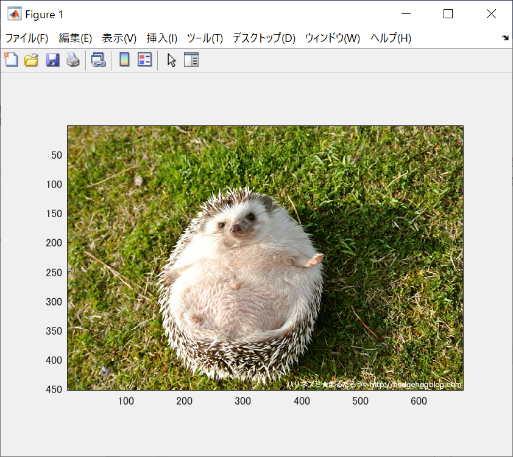

ORG=imread('harinezumi.jpg'); 原画像の入力  
imagesc(ORG); axis image; 画像の表示

 

図1 原画像
IMG = imresize(ORG,0.5); ％画像の縮小
IMG2 = imresize(IMG,2,'box'); ％画像の拡大

から1/2サンプリングの結果を表示した。図2が表示された画像である。
 
図2 1/2サンプリング画像
図3~図6は1/8から1/32のサンプリング画像である。
 
図3 1/4サンプリング画像
 
図4 1/8サンプリング画像
 
図5 1/16サンプリング画像
 
図6 1/32サンプリング画像

