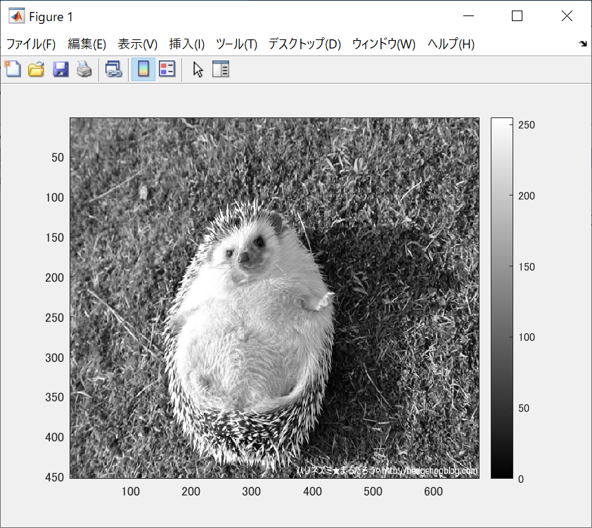
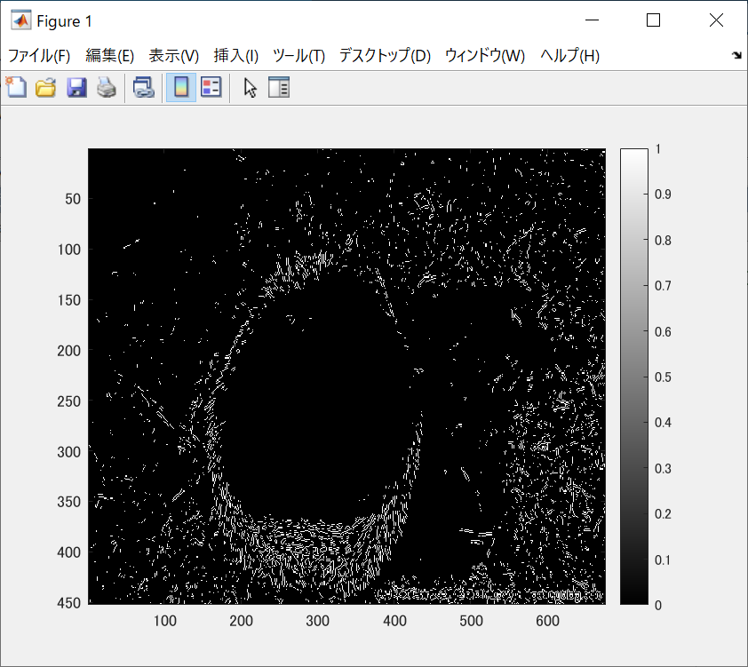
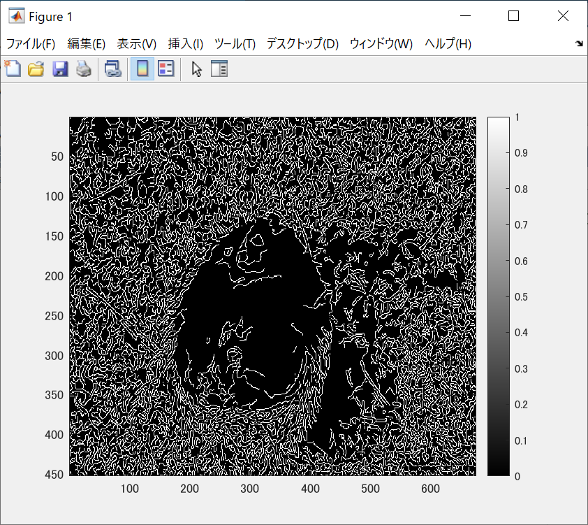

ORG = imread('harinezumi.jpg'); % 原画像の入力  
ORG = rgb2gray(ORG); %カラーからグレイへの変換  
imagesc(ORG); colormap('gray'); colorbar;% 画像表示  
で表示された画像が図1である。

  
図1 標準画像

IMG = edge(ORG,'prewitt'); % エッジ抽出（プレウィット法)  
imagesc(IMG); colormap('gray'); colorbar;% 画像表示  
で表示されたものが図2である。

  
図2 プレウィット法

IMG = edge(ORG,'sobel'); % エッジ抽出（ソベル法）  
imagesc(IMG); colormap('gray'); colorbar;% 画像表示  

  
図3 ソベル法

IMG = edge(ORG,'canny'); % エッジ抽出（キャニー法）  
imagesc(IMG); colormap('gray'); colorbar;% 画像表示  
で表示された画像が図4である。

  
図4 キャニー法
