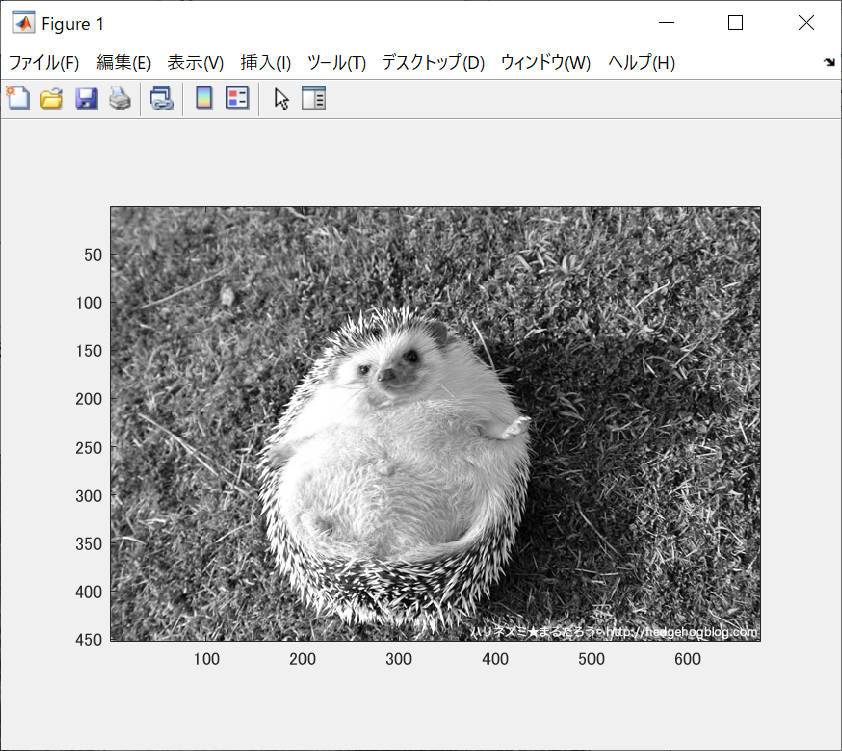
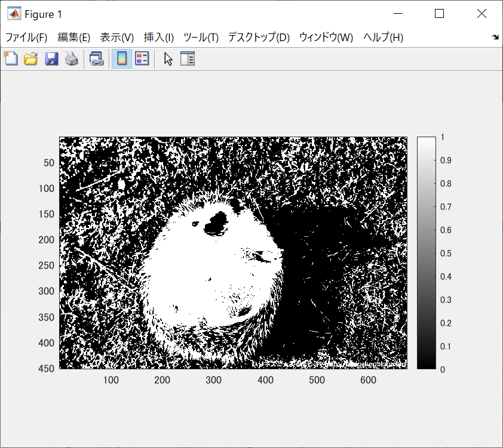
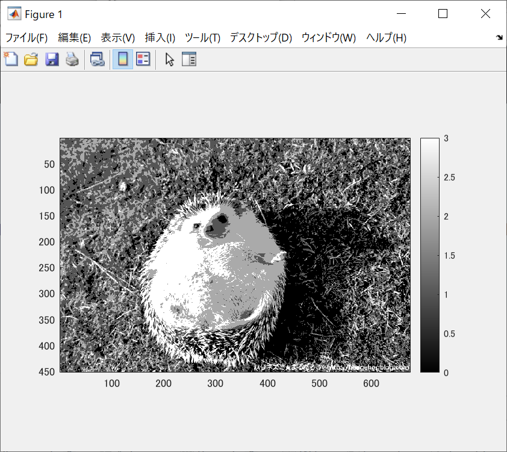

下の図はそれぞれ２階調，４階調，８階調の画像を生成させたものである。 

ORG=imread('harinezumi.jpg'); % 原画像の入力 
ORG = rgb2gray(ORG); colormap(gray); colorbar; 
で図1の白黒の原画像が表示された。

  
図1 白黒の原画像

IMG = ORG>128;  
imagesc(IMG); colormap(gray); colorbar;  axis image;  
で図2の2階調の画像が表示された。  

  
図2 2階調の画像  

IMG0 = ORG>64; 
IMG1 = ORG>128; 
IMG2 = ORG>192; 
IMG = IMG0 + IMG1 + IMG2; 
で図3の4階調の画像が表示された。

  
図3 4階調の画像
