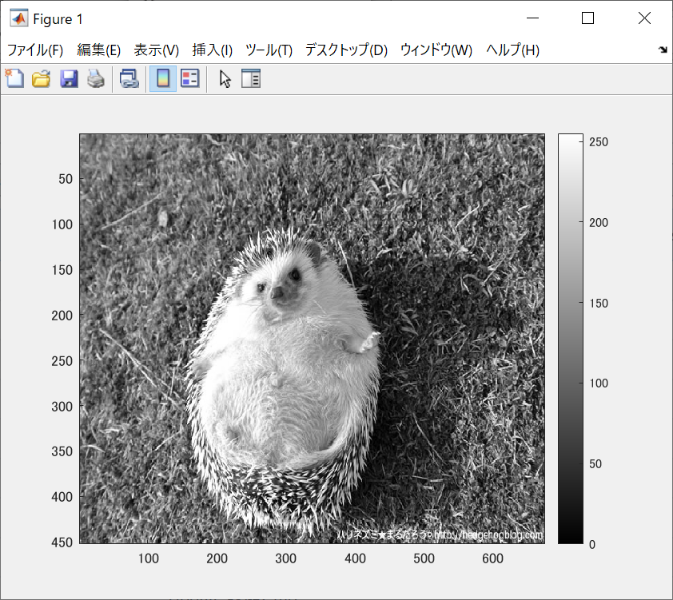
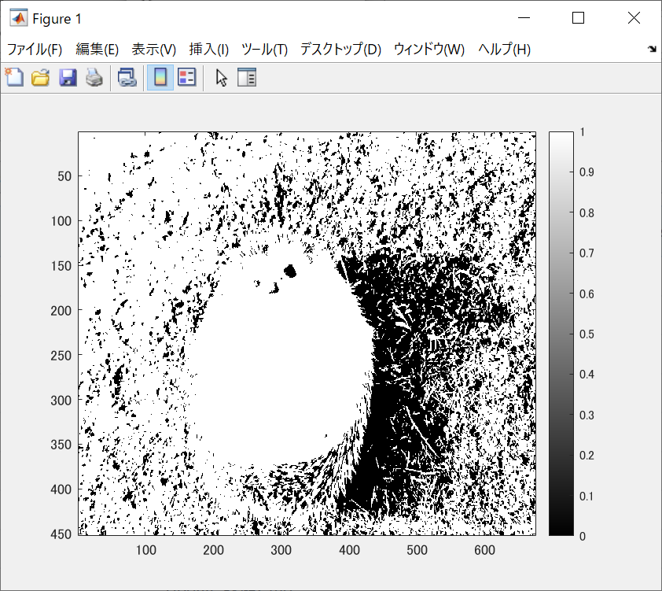
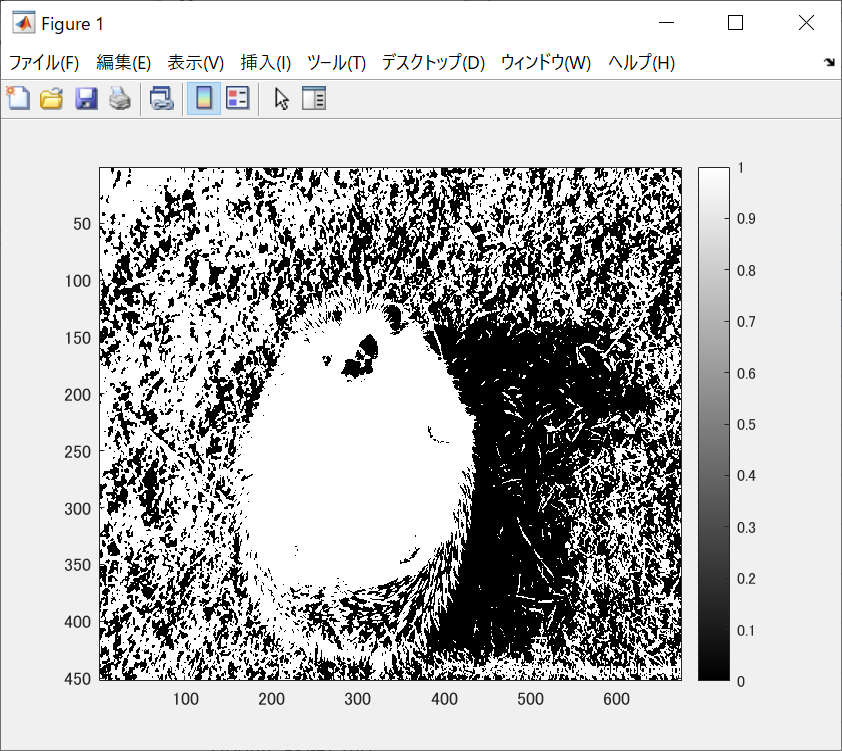
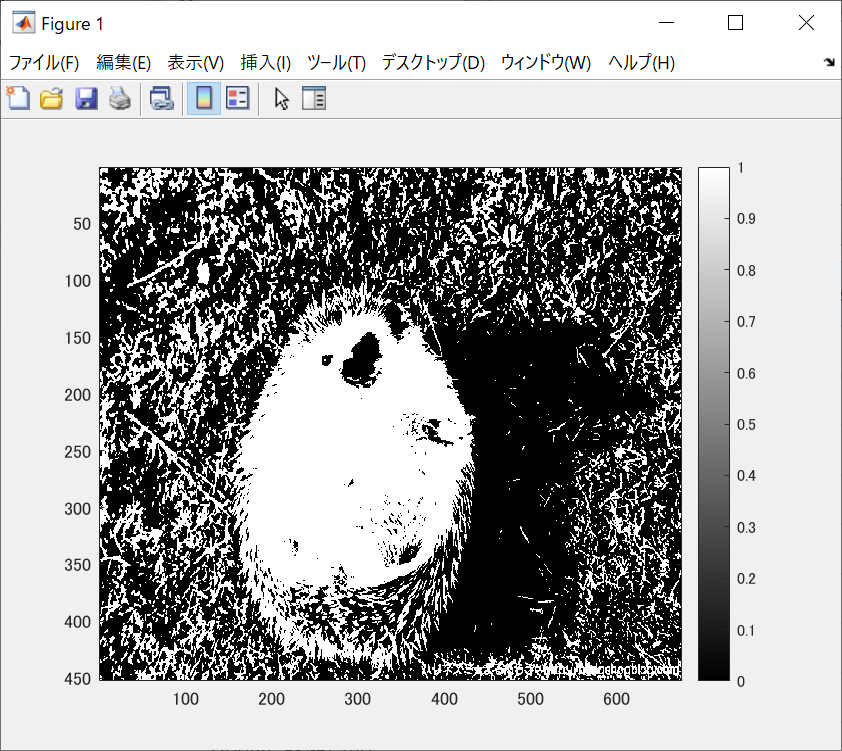
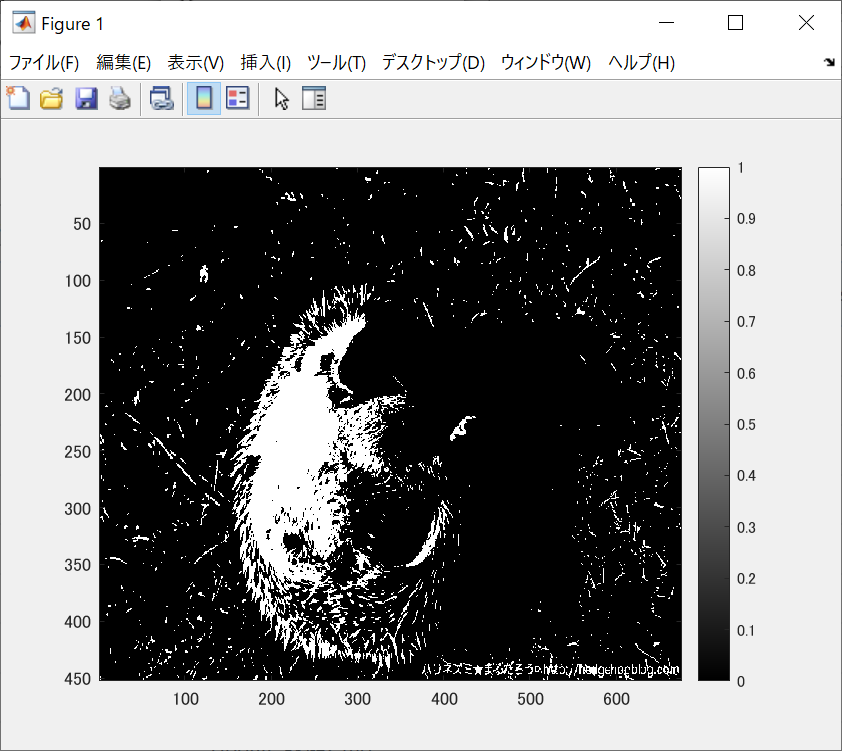

下の図は閾値を4パターン設定し,閾値処理た画像である。  

ORG=imread('harinezumi.jpg'); % 原画像の入力 
ORG= rgb2gray(ORG); % カラー画像を白黒濃淡画像へ変換 
で原画像のカラー画像を白黒濃淡画像へ変換したものが図1である。

 
図1 白黒濃淡画像への変換

図2は輝度値が64以上の画素を1，その他を0に変換させ表示させたものである。  

  
図2 輝度値が64以上の場合  

図3は96以上の画素を1，その他を0に変換させ表示させたものである。

  
図3 輝度値が96以上の場合

図4は128以上の画素を1，その他を0に変換させ表示させたものである。

  
図4 輝度値が128以上の場合

図5は192以上の画素を1，その他を0に変換させ表示させたものである。

  
図5 輝度値が192以上の場合
