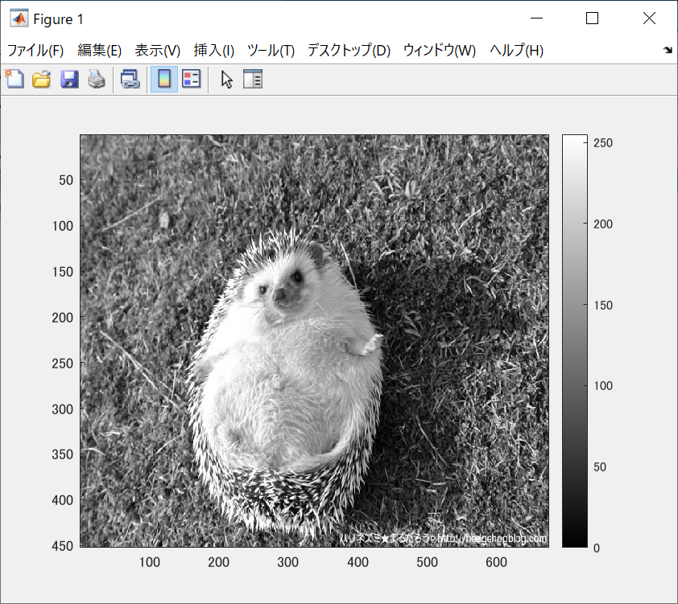
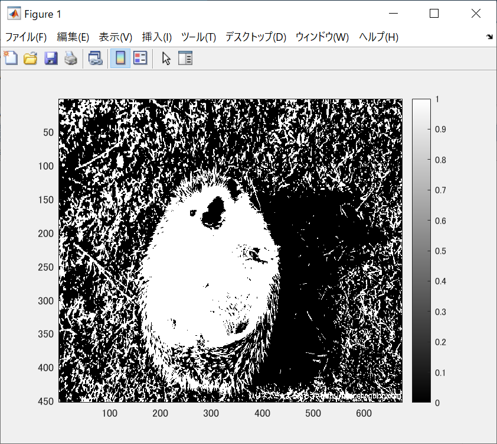

ORG=imread('harinezumi.jpg'); % 原画像の入力  
ORG = rgb2gray(ORG);  
imagesc(ORG); colormap(gray); colorbar; % 画像の表示  
で原画像を表示させたものが図1である。

  
図1 原画像

IMG = ORG>128; % 128による二値化  
imagesc(IMG); colormap(gray); colorbar; % 画像の表示  
で表示した画像が図2である。

  
図2 128による二値化

図3はディザ法によって二値化された画像である。

  
図3 ディザ法
