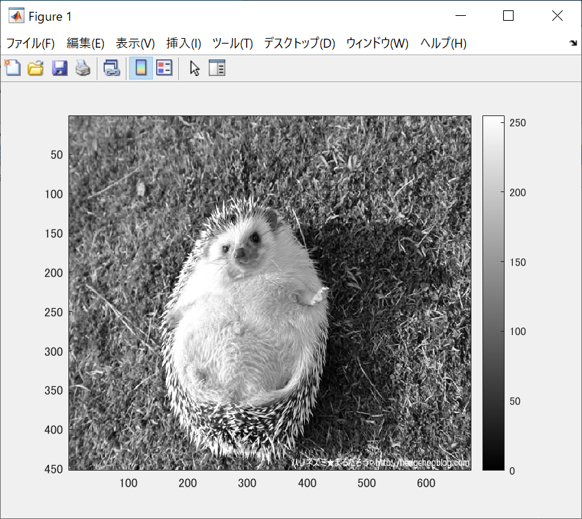
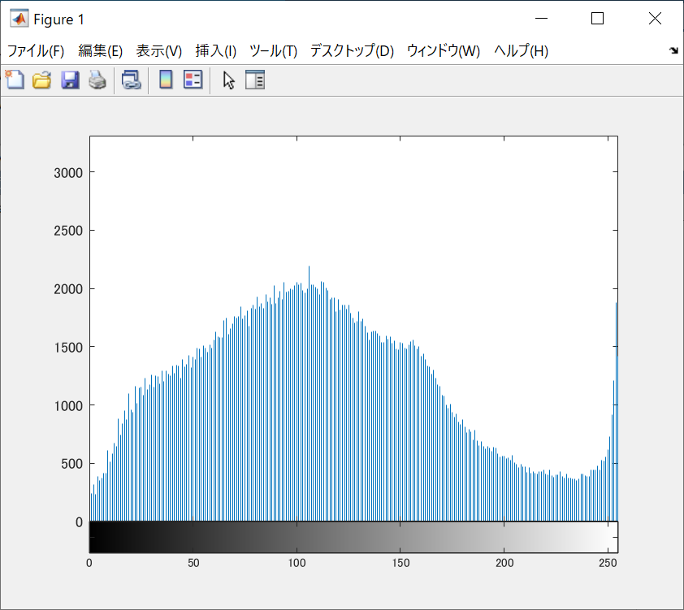

ORG = imread('harinezumi.jpg'); % 画像の読み込み  
ORG = rgb2gray(ORG); % 白黒濃淡画像に変換  
imagesc(ORG); colormap(gray); colorbar; % 画像の表示  
で表示されたものが図1である。

  
図1 白黒濃淡画像

図1の濃度ヒストグラフを表したものが図2である。

  
図2 濃度ヒストグラフ

  
図3 濃度ヒストグラフ
