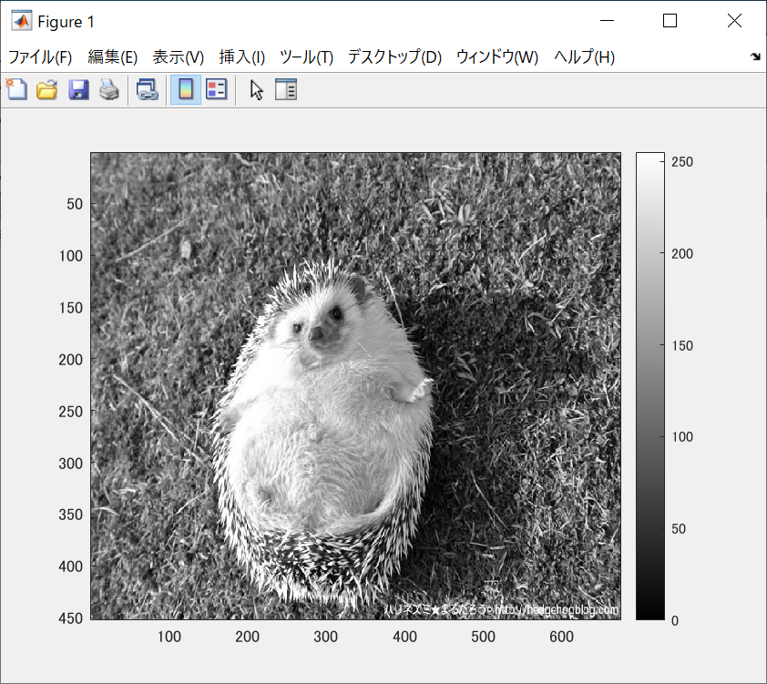
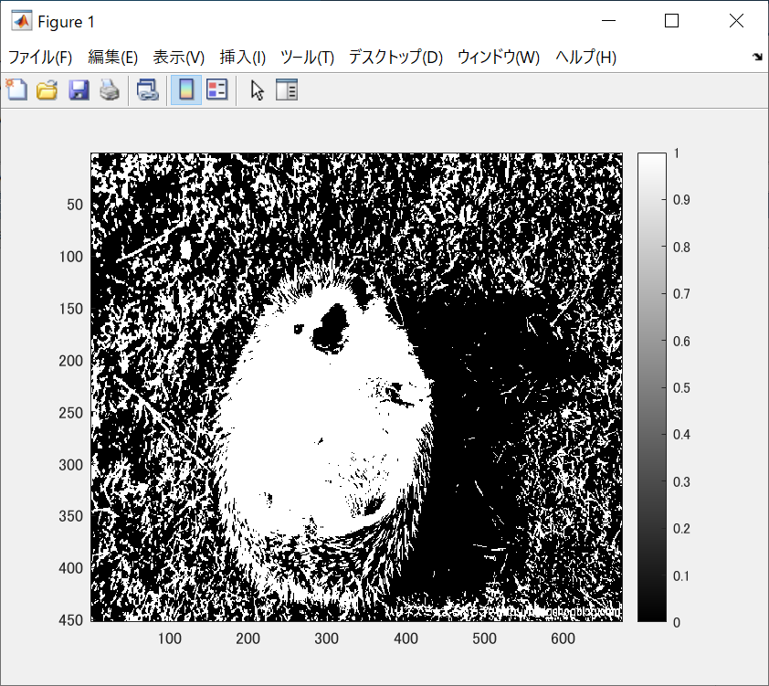
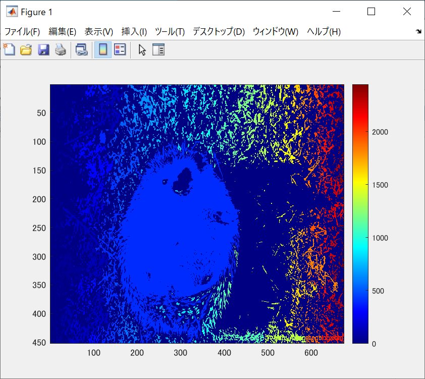

ORG = imread('harinezumi.jpg'); % 画像の読み込み 
ORG = rgb2gray(ORG); % 白黒濃淡画像に変換 
imagesc(ORG); colormap(gray); colorbar; % 画像の表示 
で表示されたものが図1である。

 
図1　白黒濃淡画像

IMG = ORG > 128; % 閾値128で二値化  
imagesc(IMG); colormap(gray); colorbar; % 画像の表示 
で二値化されcolormapをグレーにしたものが図2である。 

 
図2 二値化画像

IMG = bwlabeln(IMG);  
imagesc(IMG); colormap(jet); colorbar; % 画像の表示  
からcolormap(jet)で特定の色の赤、緑、青が強調される。表示されたものが図3である。  

  
図3 ラベリング
