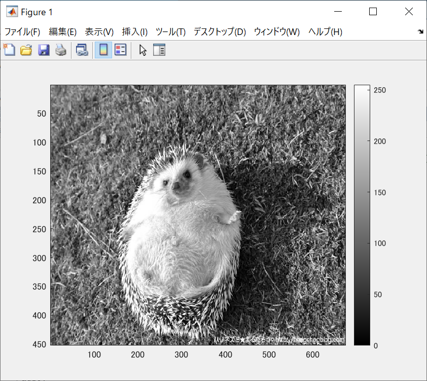
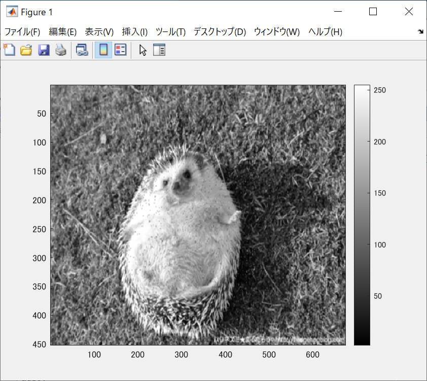

ORG = imread('harinezumi.jpg'); % 画像の読み込み 
ORG = rgb2gray(ORG); % 白黒濃淡画像に変換 
imagesc(ORG); colormap(gray); colorbar; % 画像の表示 
で表示されたものが図1である。

  
図1 白黒濃淡画像

ORG = imnoise(ORG,'salt & pepper',0.02); % ノイズ添付 
imagesc(ORG); colormap(gray); colorbar; % 画像の表示 
でノイズをのせたものが図2ある。

  
図2 ノイズがのった場合

IMG = filter2(fspecial('average',3),ORG); % 平滑化フィルタで雑音除去  
imagesc(IMG); colormap(gray); colorbar; % 画像の表示  
で図2を平滑化フィルタで雑音除去した画像が図3である。

  
図3 雑音除去

IMG = medfilt2(ORG,[3 3]); % メディアンフィルタで雑音除去  
imagesc(IMG); colormap(gray); colorbar; % 画像の表示  
で表示されたものが図4である。

 
図4 メディアンフィルタで雑音除去した場合

f=[0,-1,0;-1,5,-1;0,-1,0]; % フィルタの設計  
IMG = filter2(f,IMG,'same'); % フィルタの適用  
imagesc(IMG); colormap(gray); colorbar; % 画像の表示  
で表示されたのが図5である。

  
図5 フィルタ
